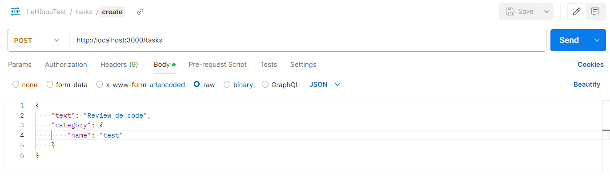

# Todo List API with Notifications

This project provides a NestJS application for managing a task list by storing them and notifying another NestJS application for each major event, which aims to log these notifications.

## Technical Stack

- NestJS (v10)
- PostgreSQL
- RabbitMQ
- Docker & docker-compose

## Project Structure

The project uses a monorepo microservice structure with the following key directories:

- **apps**: This directory contains the source code for two applications:
  - **todo-list**: This application acts as a "producer" and allows users to create, update, and delete categorized (or uncategorized) tasks. It uses a PostgreSQL database named "todo-list" for persistence and publishes messages to RabbitMQ for notification purposes.
  - **notifications**: This application acts as a "consumer", subscribing to the RabbitMQ queue and logging messages related to created, updated, or deleted tasks.
- **docker-compose.yml**: This file configures a multi-container environment with RabbitMQ, PostgreSQL, and both NestJS applications.

- **nest-cli.json**: This file configures the Nest CLI for the monorepo structure.

- **.env**: This file stores the environment variables used by the applications.

## Prerequisites

To run this project, you will need the following :

- Node.js and npm installed on your system.

- Docker and docker-compose installed and running.

## Installation

Clone this repository.

Install dependencies (for both applications):

    npm install

Configure environment variables in the .env file (insecure default values):

    RABBITMQ_DEFAULT_USER="Nom de l'utilisateur global de l'appication rabbitMQ"

    RABBITMQ_DEFAULT_PASS="Mot de passe global de l'appication rabbitMQ"

    RABBITMQ_USER="Nom de l'utilisateur pour avoir accès au channel"

    RABBITMQ_PASS="Mot de passe pour avoir accès au channel"

    RABBITMQ_HOST="Le nom de domaine"

    RABBITMQ_PORT="Le port d'accès au programme"

    RABBITMQ_NOTIFICATIONS_QUEUE="Le nom de la queue"

    POSTGRES_USER="Nom de l'utilisateur global de la base de donnée"

    POSTGRES_PASSWORD="Mot de passe global de la base de donnée"

    POSTGRES_DB="Nom de la base de donnée"

    POSTGRES_HOST="Le nom de domaine de la base"

    POSTGRES_PORT="Le port d'accès à la base"

## Running the Application

Build Docker images:

    docker-compose build

Start the application with Docker Compose:

    docker-compose up -d

This will start both NestJS applications (todo-list and notifications) along with RabbitMQ and PostgreSQL containers.

If you want to start NestJS locally:

    npm run dev <nom_de_l'application>

## Using the Application

**L'API Todo-list** : Currently, no user interface is provided to interact with the todo-list application. You can explore the API's features directly with Postman (URL: http://localhost:3000) or develop a separate client application to interact with the API

Postman example:

**RabbitMQ** : You can access the management interface at this URL http://localhost:15672 with credentials "user" and "password" or those you have previously defined.

**Les logs de Notifications** : The notifications application listens to messages from the RabbitMQ queue and logs them. You can access the logs from your terminal like this:

    docker logs -f notifications
